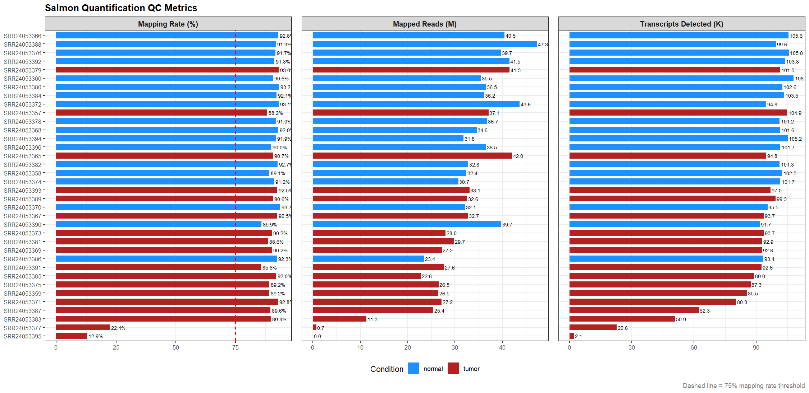
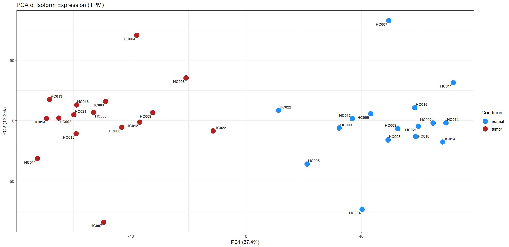
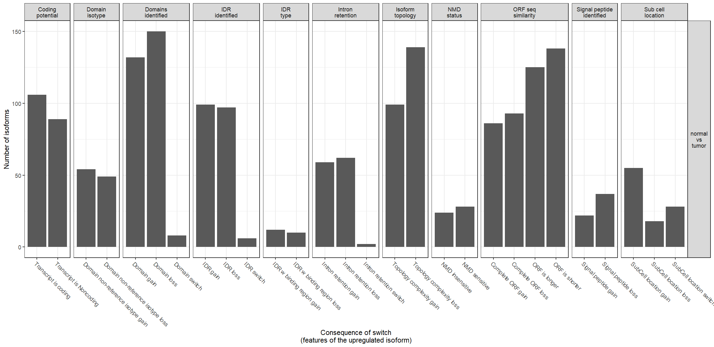
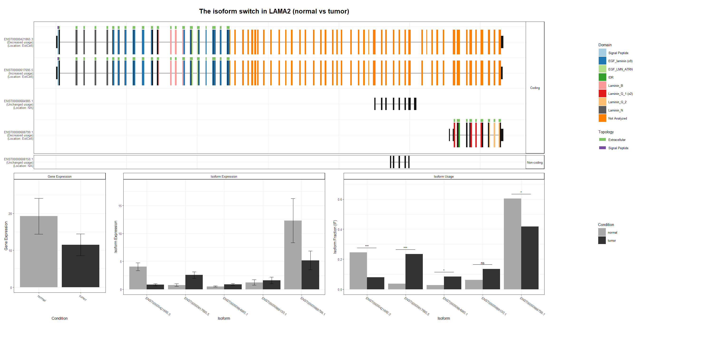
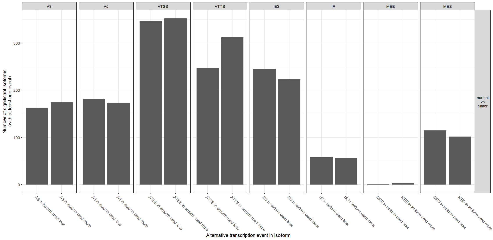
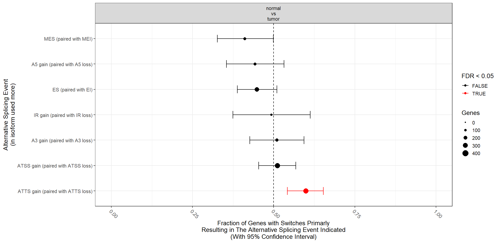

# Isoform Switch Analysis in Hürthle Cell Carcinoma (HCC)

## Background & Motivation

Hürthle cell carcinoma (HCC) is a subtype of thyroid cancer, accounting for 3-5% of all thyroid malignancies. HCC is characterised by an abundance of malfunctioning mitochondria and poor response to radioiodine therapy. While prior studies have documented mitochondrial complex I DNA mutations and metabolomic vulnerabilities in HCC, the transcriptomic landscape 
remains largely unexplored. No studies to date have specifically characterised isoform switching events in HCC.

The analysis is performed on NCBI GEO dataset and explores the expression profiles of different isoforms in HCC tissues. The original study explored metabolomic profiles of HCC and identified that mitochondrial complex I loss along with lipid peroxide stress is a vulnerability in HCC. This analysis performed on a subset of samples explores the isoform profiles in HCC, identifies some major genes undergoing functional isoform switching and highlights alternative splicing mechanisms that may drive the pathogenesis of the disease. 

**Preprint:** For complete methodology and detailed results, please see the bioRxiv preprint: [Functional Characterization of Transcriptome-Wide Isoform Switching in Hürthle Cell Carcinoma (HCC)](https://doi.org/10.64898/2026.07.23.740299).

## Objective

* Quantify the expression of transcripts between normal & HCC tissues.
* Identify transcript isoforms in HCC tissues. 
* Predict functional consequences & alternative splicing event mechanisms in HCC tissues. 

## Dataset

The dataset for this analysis have been obtained from NCBI GEO with accession ID [GSE228870](https://www.ncbi.nlm.nih.gov/geo/query/acc.cgi?acc=GSE228870).

## Methodology 

1. **Data Import**

- Download paired-end raw reads (fastq files) from NCBI GEO. 

- Tool: `fasterq-dump`

2. **Initial QC**

- Check the quality of raw reads, including per base sequence quality, adapter sequences, GC content etc. 

- Tool: `fastqc`

3. **QC**

- All-in-one processing to remove low quality sequences, over represented sequences & adapter trimming. 

- Tool: `fastp`

4. **Quantification**

- Mapping & quantification of reads against a reference transcriptome (GRCh38). 

- Tool: `Salmon`

5. **Post-Alignment QC**

- Check the mapping quality & mapping rate of reads against the reference transcriptome. 

- Tool: `MultiQC`

6. **Isoform Switch Analysis**

- Isoform switches in tumor samples along with their functional consequences including Non-sense mediated decay (NMD) sensitivity, intron retention & coding potential of isoform was analyzed. 

- Tool: `IsoformSwitchAnalyzeR`

7. **Visualization**

- Statistically significant switches, alternative splicing events & consequence summary for different genes was visualized.

- Tool: `IsoformSwitchAnalyzeR`

8. **Validation**

- The expression of genes and their respective isoforms in normal thyroid tissue and the splicing mechanisms in thyroid cancer were used to validate genes and isoforms in HCC. 

- GTEx portal and TCGA SpliceSeq. 

## Analytical Decisions & Rationale

**Why Salmon over HISAT2 + featureCounts?**

Isoform-level quantification requires transcript-level resolution. `HISAT2` + `featureCounts` is optimised for gene-level count matrices and would have required additional assembly steps (e.g. `StringTie`) to recover novel isoforms, which was outside the scope of this analysis. `Salmon`'s quasi-mapping approach quantifies directly against the reference transcriptome at transcript resolution, is computationally efficient, and its output integrates directly with `IsoformSwitchAnalyzeR`. 
`--validateMappings` was enabled to improve mapping accuracy by removing invalid multi-mapping reads.
`--gcBias` and `--seqBias` flags were used to account for systematic biases inherent to Illumina sequencing.

**Why isoform-level analysis over standard DEG?**

Standard DEG analysis (e.g. `DESeq2` on gene-level counts) would not capture scenarios where total gene expression is stable but isoform usage shifts — a pattern that can have profound functional consequences. 


## Results

### Salmon Quantification

The overall mapping rate of samples ranged from 85.62% to 93.71%. Two samples showed mapping rate < 75% (SRR24053377 & SRR24053395). These tumor samples along with their matched controls (SRR24053378 & SRR24053396 respectively) were dropped to preserve paired design integrity, leaving 16 pairs (32 samples) for isoform switch analysis. [Figure 1](#figure1)shows the combined QC metrics of all samples, illustrating that majority of samples passed the mapping rate threshold of 75%, with mapped reads and transcript count exceeding 20.4M and 50.9K respectively. 

<figure id="figure1" style="text-align: center; margin-bottom: 25px;">
  
  <figcaption><b>Figure 1:</b> Combined QC metrics for the transcript quantification data.</figcaption>
</figure>

<br><br>
PCA on log2-transformed TPM values from 25% most variable isoforms showed separation between normal and tumor samples ([Figure 2](#figure2)). Tumor samples clustered predominantly on left side of the plot while normal samples clustered on the right side. PC1 explained 37.4% of total variance and separation of tumor and normal samples along the x-axis suggested that biological condition is the primary driver of transcriptomic variability. PC2 explained 13.3% variance and captured inter-patient heterogeneity. However, samples HC004, HC005 and HC007 showed larger distances across both PCs, suggesting greater transcriptomic divergence between tumor and normal tissues in these patients. Sample HC022 showed intermediate variance across PC1 suggesting lower transcriptomic divergence between its tumor and normal samples compared to the rest of dataset. 

<figure id="figure2" style="text-align: center; margin-bottom: 25px;">
  
  <figcaption><b>Figure 2:</b> PCA plot evaluating global sample variance based on transcript expression profiles.</figcaption>
</figure>

<br><br>
`IsoformSwitchTestDEXSeq()` identified 514 isoform switching events across 472 genes involving 760 distinct isoforms. Differential isoform usage identified 514 statistically significant isoform switches across 472 genes as significant (q-value < 0.05 and |dif| > 0.1). After filtering the list for functional consequences, 371 isoform switches across 335 genes involving 551 isoforms remained. Switch consequence summary plot ([Figure 3](#figure3)) shows functional outcome of isoform switches in HCC. The plot indicates that isoforms in HCC lose protein domains more frequently than gain protein domains and have reduced topology complexity. Moreover, isoforms in HCC result in production of shorter ORFs and majority of isoforms retain their coding potential. Isoforms expressed in HCC frequently exhibited signal peptide loss and are expressed in different sub-cellular localization than their normal counterparts. Collectively, these findings indicate that isoforms overexpressed in HCC encode for shorter ORFs with smaller protein domains, have simpler membrane topology, reduced  involvement in secretory pathways and are predicted to acquire novel sub-cellular localizations. 

<figure id="figure3" style="text-align: center; margin-bottom: 25px;">
  
  <figcaption><b>Figure 3:</b> Summary of identified isoform switches featuring predicted functional consequences.</figcaption>
</figure>

<br><br>
Top genes filtered after q-value and dif cutoff included LAMA2 (rank = 1, dif = 0.197, q-value = 1.08e-31), LSP1 (rank = 2, dif = 0.386, q-value = 5.27e-20), MAD2L2 (rank = 3, dif = -0.331, q-value = 7.12e-19), and CXCL12 (rank = 10, dif = -0.334, q-value = 4.31e-11). Switch Plot for LAMA2 ([Figure 4](#figure4))shows overall gene expression of LAMA2 is reduced to half in tumor tissues, while the absolute expression of one if its isoforms ENST00000617695.5 is increased in tumor tissues. Isoform usage plot shows that ENST00000617695.5 is used significantly more in HCC than in normal tissues. On the other hand, usage of ENST00000421865.3 and ENST00000688799.1 is significantly decreased in tumor tissues relative to normal tissue. ENST00000617695.5 is one of the coding isoforms of LAMA2 and the switch plot show that the isoform lacks a C-terminus protein region present in the canonical isoform ENST00000421865.3. This truncation may compromise the laminin polymerization within extracellular matrix (ECM). ENST00000688799.1 is also a coding isoform and has relatively simpler structure consisting of shorter sequences and fewer domains than other isoforms of LAMA2. 

<figure id="figure4" style="text-align: center; margin-bottom: 25px;">
  
  <figcaption><b>Figure 4:</b> Detailed structural layout and switch-expression profile for the <i>LAMA2</i> gene.</figcaption>
</figure>

<br><br>
A summary graph of overall alternative splicing events for 760 isoforms ([Figure 5](#figure5)) show that ATSS was the dominant event in both isoforms used more and less in HCC. ATTS show a directional asymmetry, with isoforms gaining this event in tumor, thereby explaining shift towards alternative termination site usage in HCC. 

<figure id="figure5" style="text-align: center; margin-bottom: 25px;">
  
  <figcaption><b>Figure 5:</b> Distribution and frequency summary of various alternative splicing event categories across the dataset.</figcaption>
</figure>

<br><br>
Among the switches with confirmed functional consequences, AS, ATSS and ATTS were evaluated. All three events had almost the same occurrence (AS: 266, ATTS: 254 & ATSS: 244). This shows that tumor cells utilize multiple mechanisms to produce isoforms. Splice enrichment graph ([Figure 6](#figure6)) was used to visualize the statistical significance of each splicing event type. The graph showed that ATTS gain was statistically significant enriched than ATTS loss (FDR < 0.05). This shows that isoform switches in HCC preferentially involves a shift towards transcripts with altered alternative 3’-ends, suggesting dysregulation of transcript termination as the mechanism behind isoform diversity in HCC. 

<figure id="figure6" style="text-align: center;">
  
  <figcaption><b>Figure 6:</b> Splice enrichment graph visualizing the statistical significance of each splicing event type in HCC.</figcaption>
</figure>

<br><br>

Validation through GTEx and TCGA SpliceSeq show that genes showing alternative splicing and isoform switching in HCC are also expressed in normal thyroid tissue. LAMA2 and MAD2L2 isoforms (ENST00000617695.5 for LAMA2, ENST00000376667.7 & ENST00000697274.1 for MAD2L2) which show increased usage in HCC are under expressed in normal thyroid, suggesting that these isoforms are tumor-related and their increased usage in HCC represents dysregulated splicing regulation. SpliceSeq results show that LAMA2, MAD2L2, LSP1 and CXCL12 undergo concordant splicing mechanisms across thyroid cancer and HCC suggesting that splicing dysregulation is shared across thyroid malignancies. Notably, LSP1 and CXCL12 were reported to undergo alternative promoter (PSI: 94.5% for LSP1) and alternative termination (PSI: 53.9% for CXCL12) respectively confirming ATTS and ATSS as significant splicing mechanisms in HCC. 

## Getting Started

To run this pipeline locally, open your terminal, clone the repository, and navigate into the project directory:

```bash
git clone https://github.com/razmia02/Isoform_Switch_Analysis.git
cd Isoform_Switch_Analysis
```

### Environment Setup 

`conda env create -f salmon_quant/env.yaml`

`conda activate salmon`


### R Dependencies

Open RStudio using the `isoformswitchanalyzer.Rproj` file and ensure the following libraries are installed:

```

if (!requireNamespace("BiocManager", quietly = TRUE))
    install.packages("BiocManager")

BiocManager::install("IsoformSwitchAnalyzeR")
install.packages(c("ggplot2", "ggrepel", "tidyr", "dplyr", "VennDiagram", "readr"))

```

## Run the Analysis Yourself

We provide two separate automation scripts inside the `salmon_quant/scripts/` directory depending on your processing needs:

### Option A: Quick Test (Single Sample)

If you want to quickly test the pipeline infrastructure without downloading the entire cohort, run `script1.sh`. This script runs the entire end-to-end pipeline (download, QC, indexing, and quantification) for just a single sample (`SRR24053380`).

```
cd salmon_quant/scripts
chmod +x script1.sh
./script1.sh

```
### Option B: Analysis on Full Dataset (Looping through Samples)

To process the full dataset (all 18 control and 18 tumor samples), use `script2.sh`. This script reads the sample accessions line-by-line from your `data/SRR_Acc_List.txt` file and automatically loops through them to download and quantify the entire cohort.

```
cd salmon_quant/scripts
chmod +x script2.sh
./script2.sh
```

### Isoform Switch Analysis

1. Navigate to the `isoformswitchanalyzer/` directory.

2. Launch RStudio by double-clicking `isoformswitchanalyzer.Rproj`.

3. Open and run `IsoformSwitchAnalyze.R`.

*Note on External Sequence Tools:* Step 6 of the R workflow utilizes webserver prediction outputs (Pfam, CPC2, DeepLoc2, SignalP, etc.). Ensure your downloaded result tracking files match the names specified in Step 7 of the script (e.g., `pfam_result.txt`, `result_cpc2.txt`) and are placed directly inside the `isoformswitchanalyzer/` folder.

## Repo Structure

```
├── isoformswitchanalyzer
    ├── IsoformSwitchAnalyze.R      # R script for isoform switch analysis
    ├── Plots/                       # Directory containing Plots
    ├── Salmon_Quant_QC.R           # R script for initial QC
    ├── metadata.csv                # metadata info
    ├── isoformswitchanalyzer.Rproj
    ├── r_session_info.txt
    ├── results/                     # Directory containing results from switch analysis
    ├── external_tools_output/       # Directory containing external tools results (Pfam, CPC2 etc.)
    └── switchlistanalyzed.rds
└── salmon_quant
    ├── data                        # Directory for fastq files
        └── SRR_Acc_List.txt        # Sample accessions for complete dataset (GSE228870)
    ├── env.yaml                    # Bash tools info
    ├── fastp_output                # fastp output
    ├── fastqc                      # fastqc output
    ├── multiqc                     # multiqc output
    ├── salmon_output               # directory containing quant.sf files from salmon
    └── scripts                     # Bash scripts to run salmon
        ├── script1.sh              # Single-sample quick execution script
        └── script2.sh              # Multi-sample batch loop pipeline script
```


## References
- [GEO DATASET](https://www.ncbi.nlm.nih.gov/geo/query/acc.cgi?acc=GSE228870)
- [Salmon Documentation](https://salmon.readthedocs.io/en/latest/salmon.html)
- [IsoformSwitchAnalyzeR Tool Paper](https://academic.oup.com/bioinformatics/article/35/21/4469/5466456)
- [Effectors Enabling Adaptation to Mitochondrial Complex I Loss in Hürthle Cell Carcinoma](https://pubmed.ncbi.nlm.nih.gov/37262067/)
- [The Molecular Landscape of Hürthle Cell Thyroid Cancer Is Associated with Altered Mitochondrial Function—A Comprehensive Review](https://www.mdpi.com/2073-4409/9/7/1570)
