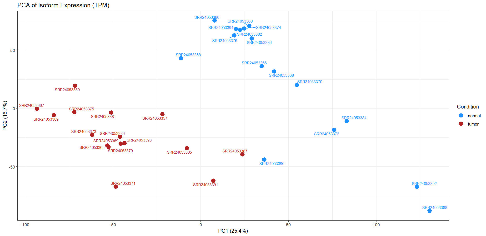
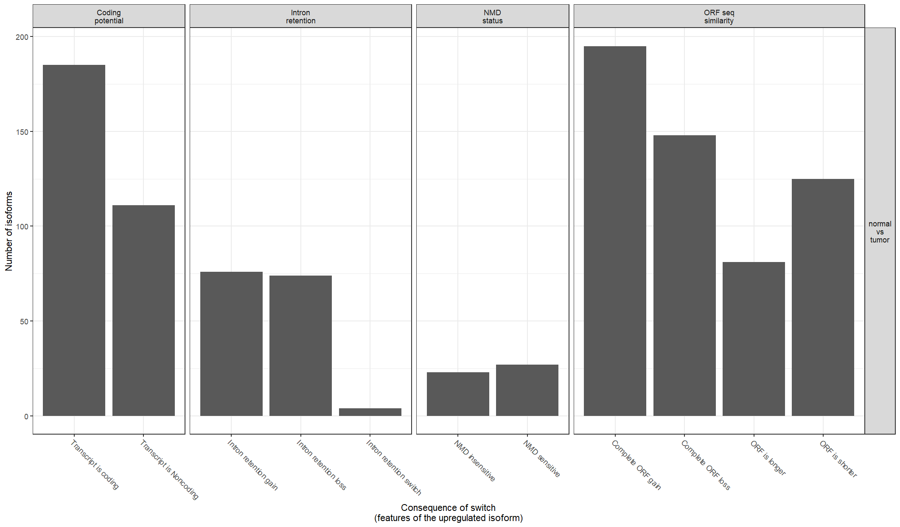
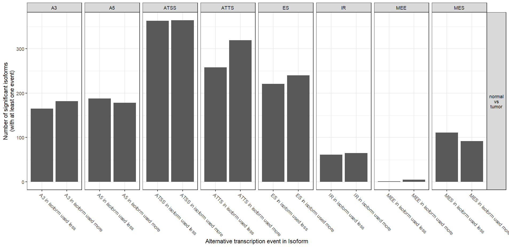
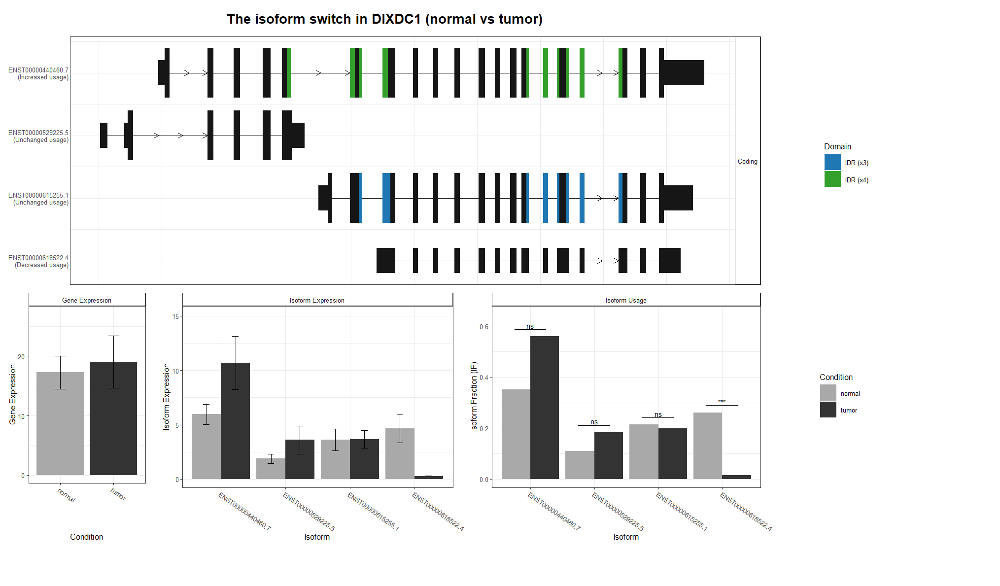

# Isoform Switch Analysis in Hürthle Cell Carcinoma (HCC)

The analysis is performed on NCBI GEO dataset and explores the expression profiles of different isoforms in HCC tissues. The original study explored metabolomic profiles of HCC and identified that mitochondrial complex I loss along with lipid peroxide stress is a vulnerability in HCC. This analysis performed on a subset of samples explores the isoform profiles in HCC, identifies some major genes undergoing functional isoform switching and highlights alternative splicing mechanisms that may drive the pathogenesis of the disease. 

## Objective

* Quantify the expression of transcripts between normal & HCC tissues.
* Identify transcript isoforms in HCC tissues. 
* Predict functional consequences & alternative splicing event mechanisms in HCC tissues. 

## Dataset

The dataset for this analysis have been obtained from NCBI GEO with accession ID [GSE228870](https://www.ncbi.nlm.nih.gov/geo/query/acc.cgi?acc=GSE228870).
The dataset was subset to include 7 HCC samples & 7 matched normal thyroid samples. 

## Methodology 

1. **Data Import**

- Download paired-end raw reads (fastq files) from NCBI GEO. 

- Tool: fasterq-dump

2. **Initial QC**

- Check the quality of raw reads, including per base sequence quality, adapter sequences, GC content etc. 

- Tool: fastqc

3. **QC**

- All-in-one processing to remove low quality sequences, over represented sequences & adapter trimming. 

- Tool: fastp

4. **Quantification**

- Mapping & quantification of reads against a reference transcriptome (GRCh38). 

- Tool: Salmon

5. **Post-Alignment QC**

- Check the mapping quality & mapping rate of reads against the reference transcriptome. 

- Tool: MultiQC

6. **Isoform Switch Analysis**

- Isoform switches in tumor samples along with their functional consequences including Non-sense mediated decay (NMD) sensitivity, intron retention & coding potential of isoform was analyzed. 

- Tool: IsoformSwitchAnalyzeR

7. **Visualization**

- Statistically significant switches, alternative splicing events & consequence summary for different genes was visualized.

- Tool: IsoformSwitchAnalyzeR


## Results

1. **Read Mapping & Sample Quality**

- Salmon automatically inferred the library type to be ISR (Inward, Stranded & Reverse). 

- All samples had high mapping rate (above 90%) against the reference transcriptome. 

2. **Sample Clustering**

- Principle Component Analysis (PCA) showed that tissue condition (tumor vs normal) was the main driver of transcriptomic heterogeneity, with PC1 accounting for 28.3% of total variance. 

- PC2 captured minor within-group heterogeneity. 



3. **Isoform Analysis & Switch Consequences**

- Differential splicing analysis identified 808 significant isoform switches in 658 distinct genes, involving 911 isoforms. 

- After filtering for functional consequences, 452 genes had 578 isoform switches that were known to cause functional consequences including intron retention, NMD, and structural modifications.

4. **Top Significant Switching Genes**

- GAB2, DXIDC1, CRTC1 & CRB3 were the most heavily altered genes. 

- Global alternative splicing mechanisms showed that 548 isoforms contain single intron retention (IR), while 143 isoforms contained multiple IR. 

5. **Functional Consequence Profiling**

- Functional consequence analysis showed that tumor upregulated isoforms alter the transcript’s coding potential and ORF structure. 

- Analysis showed balanced rate of intron retention and intron gain while small subset of switches resulted in altered NMD sensitivity. 


6. **Alternative Splicing & Genome-Wide Enrichment**

- Analysis of alternative splicing events showed that alternative transcription start site (ATSS) and alternative transcription termination sites (ATTS) are the main events driving isoform variation within tumor samples. 

- Genome-wide splicing enrichment analysis identified that transcripts undergoing ATSS and ATTS events showed a significant enrichment toward "gain" features, indicating preferential usage of alternative upstream initiation and downstream termination coordinates in tumor tissue.  




**Detailed Results for DIXDC1 gene**

The most significant isoform switch within DIXDC1 genes shows that longer, protein-coding transcript ENST00000440460.7 in tumor samples, while the transcript ENST00000618522.4 is suppressed in tumor samples. While gene expression remains almost the same in tumor and normal samples, individual transcripts showed that upregulated tumor isoform gained intrinsically disordered region (IDR). This altered isoform expression suggests a role of this isoform in HCC profile. 



## Limitations

1. **Absence of Decoy Sequences in Transcript Quantification**

Transcript-level abundance estimation using Salmon was performed without incorporating a selective-alignment decoy index. This potentially increases the rate of false-positive multi-mapping reads, particularly from genomic regions with high sequence homology or unannotated pseudogenes.

2. **Lack of Protein Domain Structural Integration**

Downstream functional consequence analysis utilizing IsoformSwitchAnalyzeR was conducted without integrating external topological or protein domain annotation databases. Consequently, while macro-structural changes like ORF lengths and IDRs were captured, localized disruptions to specific functional or catalytic protein domains remain uncharacterized.


## Repository Structure 
```
Isoform_Switch_Analysis/
├── salmon_quant/                # Main directory for performing Salmon Quantification
│   ├── data/                    # Accession List for selected samples
│   ├── fastp_output/            # For fastp.json files
│   ├── fastqc/                  # For fastqc reports
│   ├── multiqc/                 # For multiqc report
│   ├── salmon_output/           # Contains salmon quant.sf files for each sample
│   └── scripts/                 # Scripts for getting data, initial QC & salmon quantification
│
└── isoformswitchanalyzer/       # Directory containing isoformswitchanalyzer
    ├── Plots/                   # Directory for Plots (from isoformswitchanalyzer)
    ├── results/                 # Directory for saving tabular results
    ├── switchanalyzer_output/   # Contains fasta files obtained from isoformswitchanalyzer
    ├── IsoformSwitchAnalyze.R   # R script for IsoformSwitchAnalyzeR
    ├── metadata.csv             # CSV file for selected samples & their condition
    ├── isoformswitchanalyzer.Rproj # R project
└── Readme.md                # Readme.md file
└── env.yaml               # Conda env for salmon
└── r_session_info.txt     # R package versions

```

## References
- [GEO DATASET](https://www.ncbi.nlm.nih.gov/geo/query/acc.cgi?acc=GSE228870)
- [Salmon Documentation](https://salmon.readthedocs.io/en/latest/salmon.html)
- [IsoformSwitchAnalyzeR Tool Paper](https://academic.oup.com/bioinformatics/article/35/21/4469/5466456)
- [Gopal, R. K., Vantaku, V. R., Panda, A., Reimer, B., Rath, S., To, T. L., Fisch, A. S., Cetinbas, M., Livneh, M., Calcaterra, M. J., Gigliotti, B. J., Pierce, K. A., Clish, C. B., Dias-Santagata, D., Sadow, P. M., Wirth, L. J., Daniels, G. H., Sadreyev, R. I., Calvo, S. E., Parangi, S., … Mootha, V. K. (2023). Effectors Enabling Adaptation to Mitochondrial Complex I Loss in Hürthle Cell Carcinoma. Cancer discovery, 13(8), 1904–1921. https://doi.org/10.1158/2159-8290.CD-22-0976](https://pubmed.ncbi.nlm.nih.gov/37262067/)
